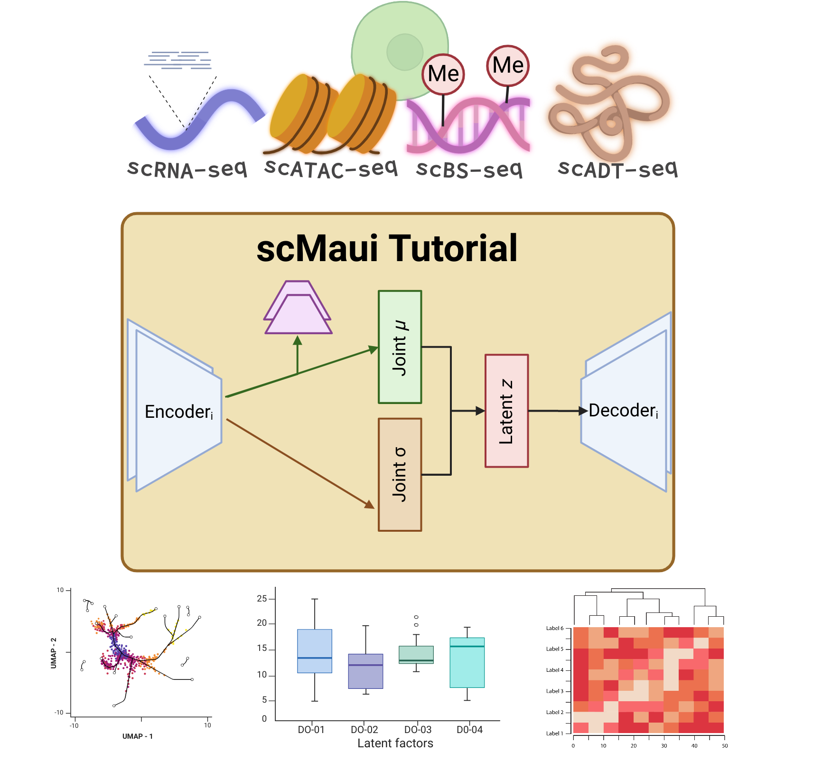

# scMaui Tutorials

This repository provides tutorials about how to use [scMaui](https://github.com/BIMSBbioinfo/scmaui) for various types of single-cell multiomics data. 
scMaui (Single-cell Multiomics Autoencoder Integration) is a new single-cell multiomics integration method based on variational product-of-experts autoencoders and adversarial learning. 
 
## Contents
- Before running scMaui
  - [Data preprocessing](https://github.com/BIMSBbioinfo/scmaui-experiments/blob/main/tutorials/01.%20Data%20preprocessing.ipynb)
- Running scMaui
    - [RNA+ATAC](https://github.com/BIMSBbioinfo/scmaui-experiments/blob/main/tutorials/02.%20Run%20scMaui%20on%20single-cell%20multiomics%20dataset.ipynb)
    - [RNA+Protein](https://github.com/BIMSBbioinfo/scmaui-experiments/blob/main/tutorials/05.%20Integration%20of%20CITE-seq%20data.ipynb)
    - [RNA+Methylation](https://github.com/BIMSBbioinfo/scmaui-experiments/blob/main/tutorials/06.%20Integration%20of%20RNA-seq%20and%20DNA%20methylation%20data.ipynb)
- After running scMaui
  - [UMAP/Clustering/Marker gene/Trajectory](https://github.com/BIMSBbioinfo/scmaui-experiments/blob/main/tutorials/03.%20Single-cell%20Multiomics%20data%20analysis%20based%20on%20scMaui%20latents.ipynb)
  - [Latent analysis](https://github.com/BIMSBbioinfo/scmaui-experiments/blob/main/tutorials/03.%20Single-cell%20Multiomics%20data%20analysis%20based%20on%20scMaui%20latents.ipynb)
 
## Citation
scMaui manuscript is available on [bioRxiv](https://www.biorxiv.org/content/10.1101/2023.01.18.524506v1).

*The figure was created using BioRender*
